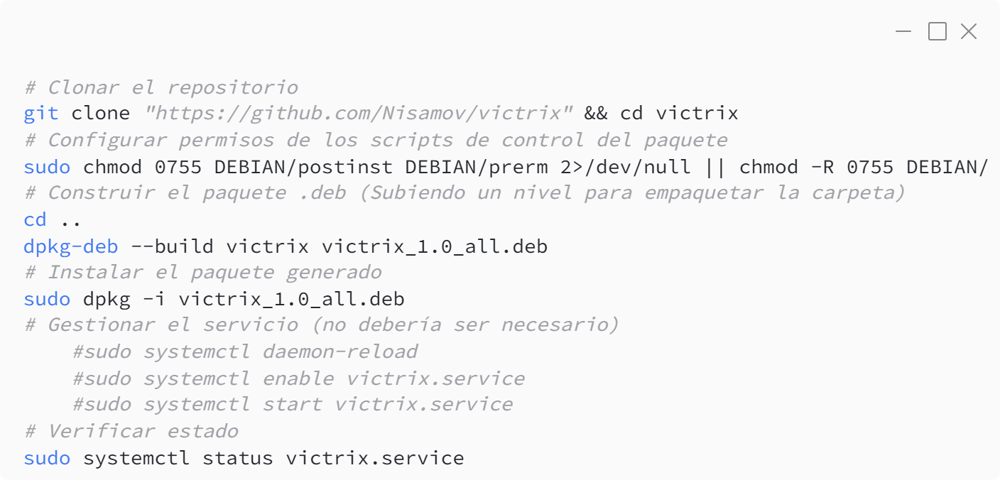
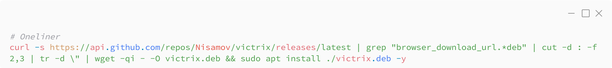

# Victrix
Servicio dedicado para ubuntu en proceso de configuracion

## Instalación
Para descargar el software, ve a [releases](https://github.com/Nisamov/victrix/releases) y descarga el paquete en el equipo.


```sh
# Clonar el repositorio
git clone "https://github.com/Nisamov/victrix" && cd victrix
# Configurar permisos de los scripts de control del paquete
sudo chmod 0755 DEBIAN/postinst DEBIAN/prerm 2>/dev/null || chmod -R 0755 DEBIAN/
# Construir el paquete .deb (Subiendo un nivel para empaquetar la carpeta)
cd ..
dpkg-deb --build victrix victrix_1.0_all.deb
# Instalar el paquete generado
sudo dpkg -i victrix_1.0_all.deb
# Gestionar el servicio (no debería ser necesario)
	#sudo systemctl daemon-reload
	#sudo systemctl enable victrix.service
	#sudo systemctl start victrix.service
# Verificar estado
sudo systemctl status victrix.service
```

Oneliner:
```sh
curl -s https://api.github.com/repos/Nisamov/victrix/releases/latest | grep "victrix.*deb" | cut -d : -f 2,3 | tr -d \" | wget -qi - -O victrix.deb && sudo apt install ./victrix.deb -y
```

## Rutas
Las rutas usadas del software son:
- `/usr/local/sbin/victrix_files` Contiene los ficheros generales del servicio.
- `/etc/victrix.conf` Contiene la configuración del servicio.
- `/lib/systemd/system/victrix.service` Servicio Secure Service Protocol

## Configuración
Para que el servicio pueda leer y aplicar la configuración establecida, es necesario reiniciar el servicio, pues este, lee durante su arranque, la configuración.
No obstante, lee activamente los ficheros de los servicios permitidos en el sistema.

**Fichero /etc/victrix.conf**
```conf
# Tiempo de espera entre revisiones (en segundos)
set intervalo 10
```

## Estructura
```
victrix
├── _repo
│   └── _media
│       ├── neg.png
│       └── victrix.png
├── .github
│   ├── workflows
│   │   └── build_deb.yml
│   └── FUNDING.yml
├── DEBIAN
│   ├── control
│   ├── postinst
│   ├── preinst
│   └── prerm
├── etc
│   └── victrix
│       └── victrix.conf
├── lib
│   └── systemd
│       └── system
│           └── victrix.service
├── usr
│   ├── sbin
│   │   ├── victrix_files
│   │   │   ├── functions
│   │   │   │   ├── f1.tcl
│   │   │   │   ├── f2.tcl
│   │   │   │   ├── f3.tcl
│   │   │   │   └── f4.tcl
│   │   │   ├── motion
│   │   │   │   └── popcat
│   │   │   │       ├── nf.txt
│   │   │   │       └── ns.txt
│   │   │   └── main.tcl
│   │   └── victrix
│   └── share
│       └── man
│           └── man8
│               └── victrix.8
├── LICENSE
└── README.md
```